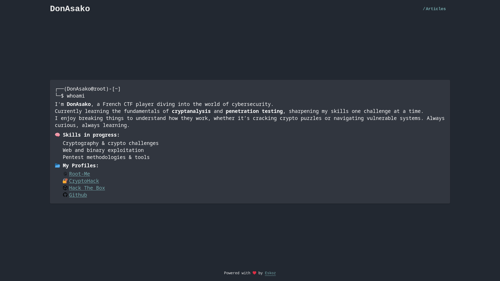

# Eskoz

[](https://github.com/DonAsako/eskoz/actions/workflows/ci.yml)
[](https://github.com/DonAsako/eskoz/releases)
[](LICENSE)
[](https://donasako.github.io/eskoz/)

**Eskoz** is a Django-based project designed to help you quickly and easily create a multilingual blog, with a straightforward deployment process.

📖 **Full documentation: [donasako.github.io/eskoz](https://donasako.github.io/eskoz/)** — installation, configuration, Docker & bare-metal deployment, theming.

## Requirements
Make sure you have the following installed on your system:
- Docker
- Docker Compose

## Installation
### 1. Clone the repository:
```sh
git clone git@github.com:DonAsako/eskoz.git
cd eskoz
```

### 2. Copy the example environment variables file:
```sh
cp .env.example .env
```

### 3. Edit the .env file to configure your environment variables.
The .env file stores your environment-specific settings. Here's what each variable does:
```yaml
# --- Django Settings ---
DEBUG=0                         # Enable (1) or disable (0) Django debug mode
DJANGO_SECRET_KEY=              # Secret key for Django security
DJANGO_ALLOWED_HOSTS=           # Space-separated list of allowed hostnames
ADMIN_URL=                      # Custom URL path for the Django admin (e.g., "admin")
THEME=                          # Active theme in themes directory (default: Eskoz)

# --- PostgreSQL Settings ---
POSTGRES_DB=                    # Name of the PostgreSQL database
POSTGRES_USER=                  # PostgreSQL username
POSTGRES_PASSWORD=              # PostgreSQL password

# --- Caddy / Domain Configuration ---
DOMAIN=                         # Your domain name (e.g., example.com)
EMAIL=                          # Email address used for SSL certificate
```

## Deploy with Docker
### 1. Build and start the Docker containers in detached mode:
```sh
docker compose -f docker/docker-compose.yml up --build -d
```

> **Prebuilt image:** every release is automatically published to the GitHub
> Container Registry. Instead of building locally, you can pull a tagged image:
> ```sh
> docker pull ghcr.io/donasako/eskoz:latest      # or a specific version, e.g. :v0.6.0
> ```

### 2. Create the first admin user
To create the first Django superuser, run:
```sh
docker compose -f docker/docker-compose.yml exec web python manage.py createsuperuser
```

### 3. Update your config
To update your config, run :
```sh
docker compose -f docker/docker-compose.yml exec web python manage.py config
```

## Customization
### Themes
#### List available themes
**To list all available themes with the following command:**
```sh
python3 manage.py list_themes
```

**Example :**
```sh
Name                      Path                                                         Active
---------------------------------------------------------------------------------------------
Eskoz                     /Eskoz/themes/Eskoz                                          Yes  

Successfully listed 1 theme(s).
```
- **Eskoz (Default)**

#### Create a new theme
**To create a brand new theme with default structure:**
```sh
python3 manage.py create_theme MyNewTheme
```
This will generate the necessary folders and files under the `themes/` directory.

**To create a new theme based on an existing one (e.g. `Eskoz`):**
```sh
python3 manage.py create_theme MyNewTheme Eskoz
```

This will copy all templates and static files from the base theme.

Once your theme is created, you can start customizing:
- HTML templates in `templates/`
- Styles and scripts in `static/`

[For template syntax reference, check out the Django Template Language Documentation](https://docs.djangoproject.com/en/5.2/ref/templates/language/)

### Apply a new theme
To activate a theme, update the .env file:
```
THEME=MyNewTheme
```
The default theme is `Eskoz`.
Then, rebuild your Docker environment:
```sh
docker compose up --build -d
```
Your new theme should now be applied and visible on the site.


## Key Features
- Ready-to-use multilingual blog
- Easy deployment with Docker
- Built-in Django admin interface


## Contributing
Contributions are welcome! Eskoz uses [Conventional Commits](https://www.conventionalcommits.org/)
for automated versioning and releases (via release-please), with quality and tests
enforced in CI. See [CONTRIBUTING.md](CONTRIBUTING.md) for the commit convention,
local setup, and the full release workflow.

## License
This project is licensed under the GNU General Public License v3.0.
See the [LICENSE](LICENSE) file for more details.
