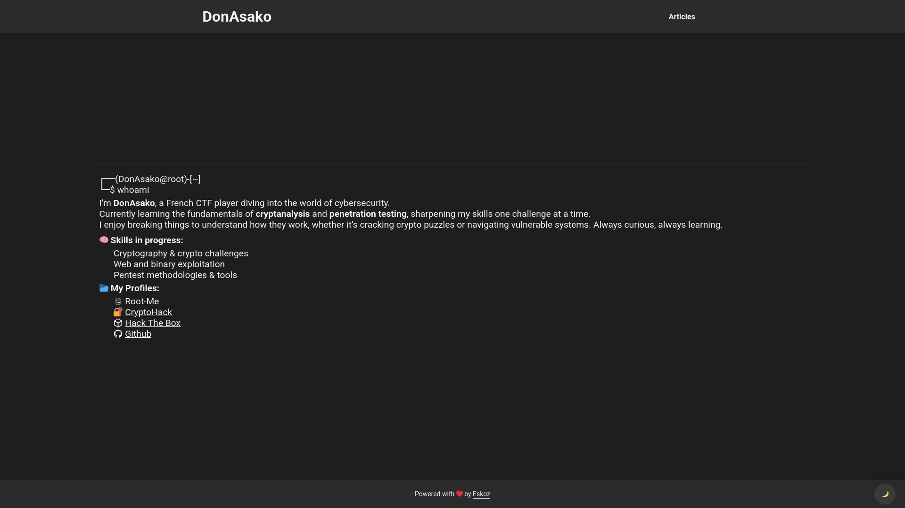
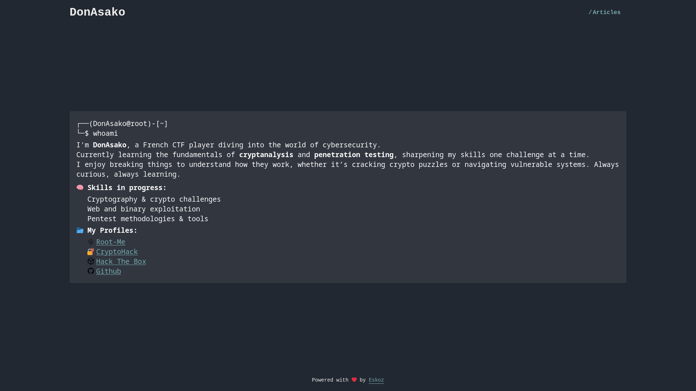

# Eskoz

**Eskoz** is a Django-based project designed to help you quickly and easily create a multilingual blog, with a straightforward deployment process.

## Requirements
Make sure you have the following installed on your system:
- Docker
- Docker Compose

## Installation
### 1. Clone the repository:
```sh
git clone git@github.com:DonAsako/eskoz.git
cd eskoz
```

### 2. Copy the example environment variables file:
```sh
cp .env.example .env
```

### 3. Edit the .env file to configure your environment variables.
The .env file stores your environment-specific settings. Here's what each variable does:
```yaml
# --- Django Settings ---
DEBUG=0                         # Enable (1) or disable (0) Django debug mode
DJANGO_SECRET_KEY=              # Secret key for Django security
DJANGO_ALLOWED_HOSTS=           # Space-separated list of allowed hostnames
ADMIN_URL=                      # Custom URL path for the Django admin (e.g., "admin")
THEME=                          # Active theme in themes directory (default: Eskoz)

# --- PostgreSQL Settings ---
POSTGRES_DB=                    # Name of the PostgreSQL database
POSTGRES_USER=                  # PostgreSQL username
POSTGRES_PASSWORD=              # PostgreSQL password

# --- NGINX / Domain Configuration ---
DOMAIN=                         # Your domain name (e.g., example.com)
EMAIL=                          # Email address used for SSL certificate
```
### 4. Build and start the Docker containers in detached mode:
```sh
docker compose up --build -d
```

### 5. Create the first admin user
To create the first Django superuser, run:
```sh
docker compose exec web python manage.py createsuperuser
```

### 6. Update your config
To update your config, run :
```sh
docker compose exec web python manage.py config
```

## Customization 
### Themes
#### List available themes
**To list all available themes with the following command:**
```sh
python3 manage.py list_themes
```

**Example :**
```sh
Name                      Path                                                         Active
---------------------------------------------------------------------------------------------
Eskoz                     /Eskoz/themes/Eskoz                                          Yes   
EskozCyber                /Eskoz/themes/EskozCyber                                     No   

Successfully listed 2 theme(s).
```
- **Eskoz (Default)**

- **EskozCyber**

#### Create a new theme
**To create a brand new theme with default structure:**
```sh
python3 manage.py create_theme MyNewTheme
```
This will generate the necessary folders and files under the `themes/` directory.

**To create a new theme based on an existing one (e.g. `Eskoz`):**
```sh
python3 manage.py create_theme MyNewTheme Eskoz
```

This will copy all templates and static files from the base theme.

Once your theme is created, you can start customizing:
- HTML templates in `templates/`
- Styles and scripts in `static/`

[For template syntax reference, check out the Django Template Language Documentation](https://docs.djangoproject.com/en/5.2/ref/templates/language/)

### Apply a new theme
To activate a theme, update the .env file:
```
THEME=MyNewTheme
```
The default theme is `Eskoz`.
Then, rebuild your Docker environment: 
```sh
docker compose up --build -d
```
Your new theme should now be applied and visible on the site.

## To-do 
### Logs
- [ ] Add Django logging configuration
- [ ] Set up log rotation (e.g. RotatingFileHandler)
- [ ] Mount Docker volume for log files
- [ ] Define log levels (INFO, WARNING, ERROR, etc.)
- [ ] Redirect container logs to files
- [ ] Add .env variable for log level

### Translate
- [ ] Make translation

### Styling
- [ ] Make the layout responsive
- [ ] Improve article detail view
- [ ] Add article parameters to the article list page
- [ ] Update Eskoz Theme

### Deployment
- [ ] Add an automatic script to load SSL certificates and simplify deployment

### Authentication / Users
- [ ] Finish connection with 2FA OTP

### Views / Pages
- [ ] View Page Settings (block view if false)
- [ ] Add members page

### New Apps
- [ ] Create Course app

## Key Features
- Ready-to-use multilingual blog
- Easy deployment with Docker
- Built-in Django admin interface


## License
This project is licensed under the GNU General Public License v3.0.
See the [LICENSE](LICENSE) file for more details.
